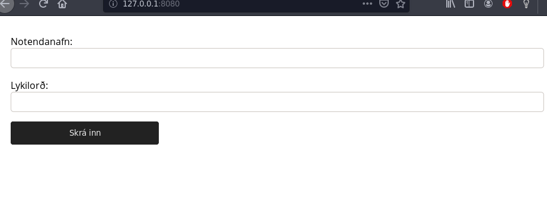
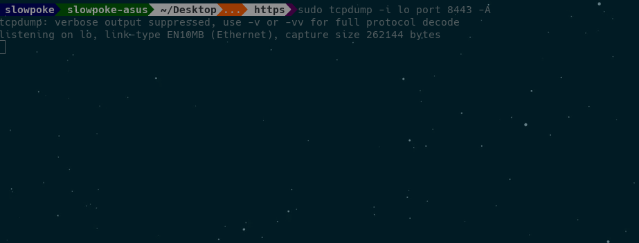
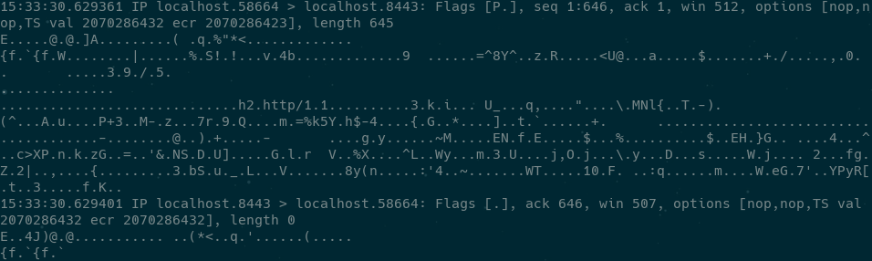

# HTTPS
## Hypertext Transfer Protocol Secure

Hjalti Geir Garðarsson

Guðmundur Óli Norland

Teitur Guðmundsson

---

# http//:
Hyper Text Transfer Protocol

---


---

1. Biðlari sendir beiðni yfir vefinn
2. Vefþjónn tekur á móti beðninni
3. Þjónninn keyrir forrit til að vinna beiðnina
4. Þjónninn skilar HTTP svari
5. Biðlarinn tekur við svarinu
---

 
---

# https//:
Hyper Text Transfer Protocol Secure


---

# TSL/SSL

---

### TSL/SSL sáttmálaferlið (handshake)
#### Skref fyrir skref með dæmum frá Uglu


---

### Skref 1.
##### Biðlari sækist eftir SSL/TSL samskiptum.

* Biðlari (*client*) sendir HTTPS beiðni á þjón (*server*) Uglu.

* Samskiptaaðferð (*SSL/TLS*).

* Dulkóðunarpakki (*Cipher Suite*)

----

#### Innihald dulkóðunarpakkans

* Algoriðmi til að búa til og skiptast á lyklum (*key exchange algorithm*).

* Algoriðmi fyrir umfangsdulkóðun (*bulk encryption algorithm*).

* Algoriðmi fyrir skilaboðastaðfestingu (*message authentication code algorithm*).

* Fókusum mest á lyklaskiptin.

---

### Skref 2.
##### Vefþjónninn svarar

----

Það sem vefþjónninn sendir til baka:

* Dulkóðunarpakka sem báðir aðilar styðja.

* Lotuauðkenni (*session ID*)

* Auðkennisskírteini sem er gefið út af þriðja aðila (*certificate authority*)

----


----


----


---

### Skref 3.
##### Biðlarinn sannprófar auðkennisskírteinið.

----

Fjögur skref:

* Er dagsetningin í dag innan gildistíma skírteinisins?

* Er þriðji aðilinn sem gefur út skírteinið á lista yfir trausta aðila hjá biðlaranum?

* Biðlarinn ber saman almenna lykilinn sem hann er með fyrir þennan aðila og þann á skírteininu.

* Stemmir lénið á skírteininu við lén þjónsins?

----

Ef komist er í gegnum öll þessi skref veit biðlarinn að þjónninn er sá sem hann segist vera.

----


---

### Skref 4.
##### Biðlarinn og þjónninn þurfa lykil til að dulkóða / afkóða skilaboð.

----

#### Samhverfir lyklaalgoriðmar

Samhverfir lyklaalgoriðmar nota einn lykil til að dulkóða og afkóða, algengast er hins vegar að nota ósamhverfa lyklaalgoriðma til þess að búa til samhverfan lykil.

----

#### Ósamhverfir lyklaalgorðmar

Án þess að vita neina stærðfræði á bakvið lyklaalgoriðma þurfum við að treysta þessu tvennu um ósamhverfa lyklaalgoriðma:

----

1. Öll skilaboð sem eru dulkóðuð með lyklinum hjá Uglu geta einungis verið afkóðuð með einkalykli Uglu.

2. Aðili með aðgang að almenna lyklinum hjá Uglu getur staðfest ef skilaboð voru send af einhverjum með aðgang að einkalykli Uglu.

----

#### ECDGE_RSA

* EC**_DG_**E: Diffie-Helmann mjög algengur ósamhverfur (asymmetric) algoriðmi.

* Biðlarinn dulkóðar skilaboð með almenna lykli Uglu til að búa til sameiginlegt leyndarmál (samhverfan lykil). Ugluþjónninn afkóðar skilaboðin með einkalykilinum sínum.

----


---

### Skref 5.
##### Staðfesting

----

* Ugluþjónninn sendir til baka staðfestingarskilaboð, dulkóðuð með leyndarmálinu / samhverfa lyklinum.

* Þetta sameiginlega leyndarmál / þessi samhverfi lykill er svo notaður til að afkóða og dulkóða öll skilaboð á milli biðlarans og þjónsins.

---

### Niðurstaðan
##### Örugg SSL/TLS samskipti á milli biðlarans og þjónsins


---


## Raunverulegt dæmi

---

### Lyklar og auðkennisskírteini

Það er mjög auðvelt að búa til sitt eigið auðkennisskírteini, ásamt lykli.

----

Lykill (*private key*)


----

Auðkennisskírteini (*certificate*)


---

## *Certificate Authority*
Vafrar treysta aðeins ákveðnum aðilum. Listi af þessum aðilum eru vanalega innbyggðir í vafrann.

* Comodo
* IdenTrust
* Symantec
* GoDaddy

----

## Firefox

```sh
prefrences -> Privacy & Security -> View Certificates...
```


----


---

### Man-in-the-middle attack

Þegar tveir aðilar eru að skiptast á upplýsingum, þá getur þriðji aðili

* hlustað á samskiptin.
* breytt pökkum

----

Svo kallaður *packet-analyzer* eða *packet-sniffer* eru notaðir til þess að fylgjast með pökkum sem er verið að senda á milli tveggja aðila (*network traffic*)

* tcpdump
* Wireshark

----

# HTTP




----

# HTTPS




----

HTTP


HTTPS



---

## Verkefnið

[github.com/http_vs_https](https://github.com/slowpokesheep/http_vs_https)


---

## Skipanir

HTTP
```
sudo tcpdump -i lo port 8080 -A
```
```
sudo tcpdump -i lo port 8080 -A | egrep -i "POST /|pwd=|passwd=|password=|Host:"
```

HTTPS
```
sudo tcpdump -i lo port 8443 -A
```

----

* <span style="color:blue">`tcpdump`</span>
  * Forrit til að fylgjast með umferð á *network*
* <span style="color:blue">`-i lo`</span>
  * Við hlustum á localhost
* <span style="color:blue">`port 8080`</span>
  * Við hlustum á porti 8080
* <span style="color:blue">`-A`</span>
  * Prentum út alla pakka á ASCII sniði

----

Hvernig búa til lykla og *certificate*

```
sudo openssl req -x509 -nodes -newkey rsa:2048 -keyout ./selfsigned.key -out selfsigned.crt
```

----

* <span style="color:blue">`openssl req`</span>
  * Forrit til að búa til lykla og *certificate*
* <span style="color:blue">`-x509`</span>
  * Við skrifum sjálf upp á *certificate*
* <span style="color:blue">`-nodes`</span>
  * Kemur í veg fyrir að *private key* sé dulkóðaður
* <span style="color:blue">`-newkey rsa:2048`</span>
  * Býr til 2048 bita RSA lykil og *certificate*
* <span style="color:blue">`-keyout -out`</span>
  * Hvert lykillinn og *certificate* eru send

---

## Heimildir

* [what_is_https](https://www.tutorialsteacher.com/https/what-is-https)
* [wikipedia_http](https://en.wikipedia.org/wiki/Hypertext_Transfer_Protocol)
* [w3_http](https://www.w3schools.com/whatis/whatis_http.asp)

----

* [youtube/how_ssl_certificate_works](https://www.youtube.com/watch?v=33VYnE7Bzpk)
* [ibm/ssl_tsl](https://www.ibm.com/support/knowledgecenter/en/SSFKSJ_7.1.0/com.ibm.mq.doc/sy10660_.htm)
* [wikipedia/cipher_suite](https://en.wikipedia.org/wiki/Cipher_suite)
* [oracle_ssl_handshake](https://docs.oracle.com/cd/E19693-01/819-0997/aakhc/index.html)
* [symmetric_vs_asymmetric_encryption](https://www.ssl2buy.com/wiki/symmetric-vs-asymmetric-encryption-what-are-differences#targetText=Symmetric%20encryption%20uses%20a%20single,and%20decrypt%20messages%20when%20communicating.&targetText=Asymmetric%20encryption%20takes%20relatively%20more%20time%20than%20the%20symmetric%20encryption)

----

* [wikipedia/man-in-the-middle-attack](https://en.wikipedia.org/wiki/Man-in-the-middle_attack)
* [wikipedia/HTTPS](https://en.wikipedia.org/wiki/HTTPS)
* [wikipedia/packet_analyzer](https://en.wikipedia.org/wiki/Packet_analyzer)
* [tcpdump_commands](https://www.tecmint.com/12-tcpdump-commands-a-network-sniffer-tool/)
* [tcpdump_cmd_password](https://techarena51.com/blog/tcpdump-examples-to-capture-passwords/)
* [openssl_help](https://www.digitalocean.com/community/tutorials/how-to-create-a-self-signed-ssl-certificate-for-apache-in-ubuntu-16-04)