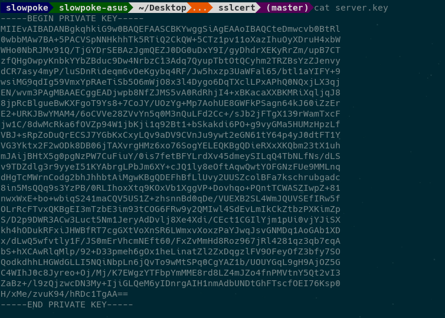
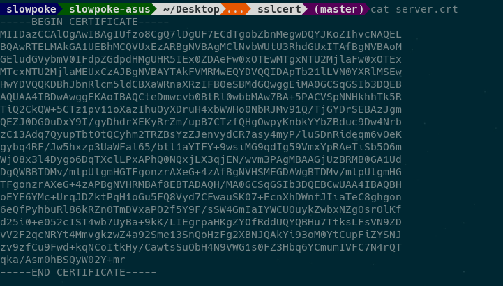
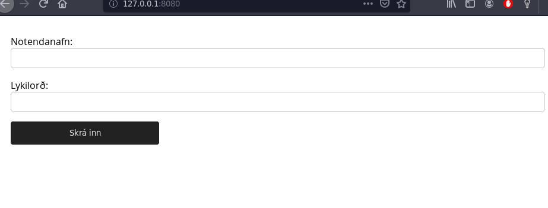
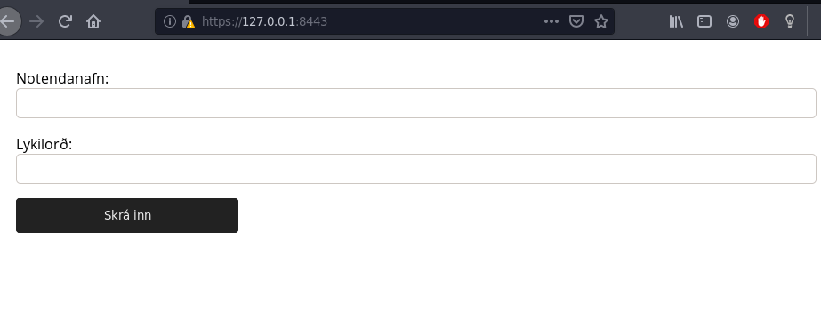
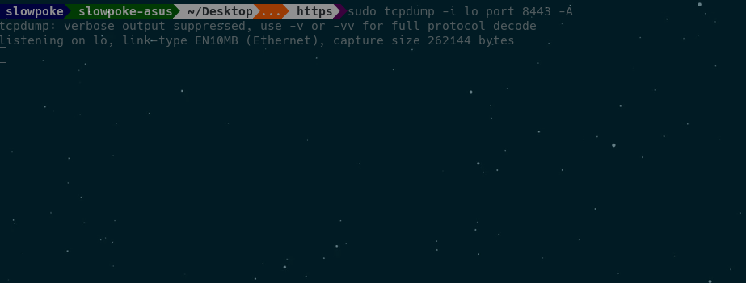
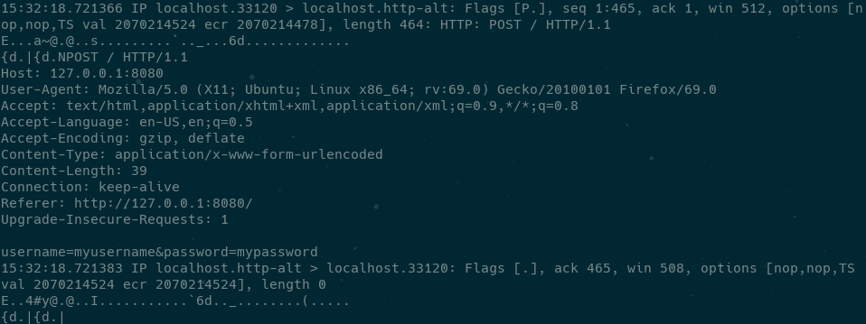
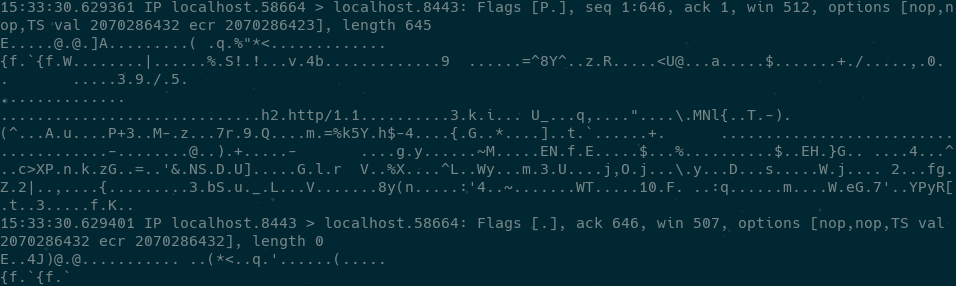
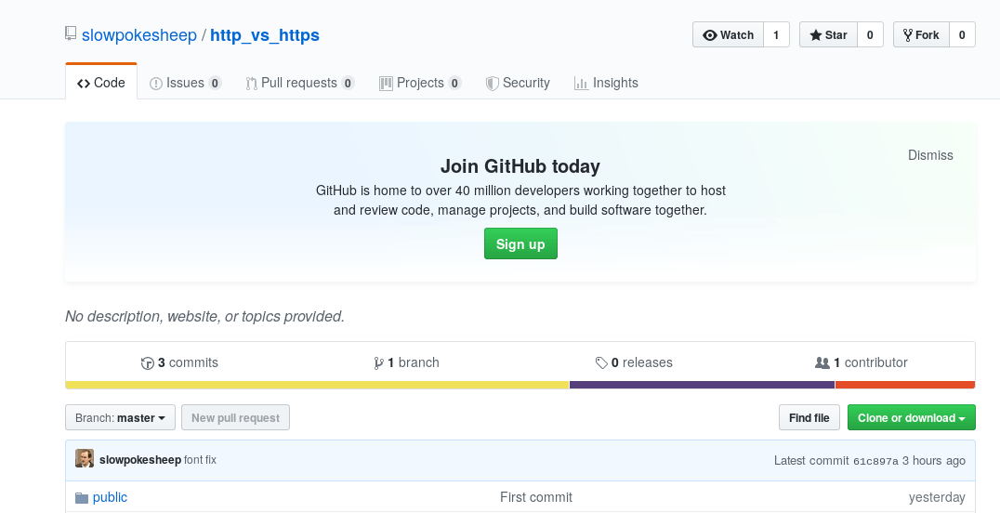

## Raunverulegt dæmi

---

### Lyklar og auðkennisskírteini

Það er mjög auðvelt að búa til sitt eigið auðkennisskírteini, ásamt lykli.

----

Lykill (*private key*)



----

Auðkennisskírteini (*certificate*)



---

## *Certificate Authority*
Vafrar treysta aðeins ákveðnum aðilum. Listi af þessum aðilum eru vanalega innbyggðir í vafrann.

* Comodo
* IdenTrust
* Symantec
* GoDaddy

----


---

### Man-in-the-middle attack

Þegar tveir aðilar eru að skiptast á upplýsingum, þá getur þriðji aðili

* hlustað á samskiptin.
* breytt pökkum

----

Svo kallaður *packet-analyzer* eða *packet-sniffer* eru notaðir til þess að fylgjast með pökkum sem er verið að senda á milli tveggja aðila (*network traffic*)

* tcpdump
* Wireshark

----

# HTTP




----

# HTTPS





----

HTTP



HTTPS



---

## Verkefnið

[github.com/http_vs_https](https://github.com/slowpokesheep/http_vs_https)


---

## Skipanir

HTTP
```
sudo tcpdump -i lo port 8080 -A
```
```
sudo tcpdump -i lo port 8080 -A | egrep -i "POST /|pwd=|passwd=|password=|Host:"
```

HTTPS
```
sudo tcpdump -i lo port 8443 -A
```

----

* <span style="color:blue">`tcpdump`</span>
  * Forrit til að fylgjast með umferð á *network*
* <span style="color:blue">`-i lo`</span>
  * Við hlustum á localhost
* <span style="color:blue">`port 8080`</span>
  * Við hlustum á porti 8080
* <span style="color:blue">`-A`</span>
  * Prentum út alla pakka á ASCII sniði

----

Hvernig búa til lykla og *certificate*

```
sudo openssl req -x509 -nodes -newkey rsa:2048 -keyout ./selfsigned.key -out selfsigned.crt
```

----

* <span style="color:blue">`openssl req`</span>
  * Forrit til að búa til lykla og *certificate*
* <span style="color:blue">`-x509`</span>
  * Við skrifum sjálf upp á *certificate*
* <span style="color:blue">`-nodes`</span>
  * Kemur í veg fyrir að *private key* sé dulkóðaður
* <span style="color:blue">`-newkey rsa:2048`</span>
  * Býr til 2048 bita RSA lykil og *certificate*
* <span style="color:blue">`-keyout -out`</span>
  * Hvert lykillinn og *certificate* eru send

---

Heimildir

* [wikipedia/man-in-the-middle-attack](https://en.wikipedia.org/wiki/Man-in-the-middle_attack)
* [wikipedia/HTTPS](https://en.wikipedia.org/wiki/HTTPS)
* [wikipedia/packet_analyzer](https://en.wikipedia.org/wiki/Packet_analyzer)
* [tcpdump_commands](https://www.tecmint.com/12-tcpdump-commands-a-network-sniffer-tool/)
* [tcpdump_cmd_password](https://techarena51.com/blog/tcpdump-examples-to-capture-passwords/)
* [openssl_help](https://www.digitalocean.com/community/tutorials/how-to-create-a-self-signed-ssl-certificate-for-apache-in-ubuntu-16-04)